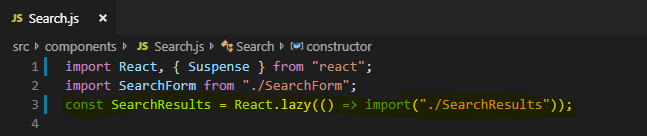

# Technical Question

##### 1. How long did you spend on the coding test? What would you add to your solution if you had more time? If you didn&#39;t spend much time on the coding test then use this as an opportunity to explain what you would add.

I have spent around one and a half hour coding and deploying the test. If I had more time I would dynamically fetch the location of the user and get the city name using some api. The other thing I would add is use the details from the api more like show the nearest restaurant based on user's and restaurants's location.

##### 2. What was the most useful feature that was added to the latest version of your chosen language? Please include a snippet of code that shows how you&#39;ve used it.

I have used React.lazy feature which was introduced in the latest version. We can do code-splitting by wrapping a dynamic import.

##### 3. How would you track down a performance issue in production? Have you ever had to do this?

To track production issue we can use React Developer Tools chrome extension and observe the state and props that are chnaging in different components. Also we can have some logging.

##### 4. How would you improve the API that you just used?

The API documentation can be better in terms of making the user understand how to use it. Moreover, few urls are not working in the response.

##### 5. Please describe yourself using JSON.

{
    "me": {
        "name": "Dharmesh Patel",
        "age": 24,
        "description": "Full Stack Developer",
        "experience": "2.5 years",
        "major-skills": [
            "React",
            "Angular",
            "Java",
            "Spring",
            "SQL"
        ],
        "accomplishments": [
            {
                "name": "All Rounder in Team"
            },
            {
                "name": "Insta Award"
            }
        ],
        "seeking-job": true
    }
}
